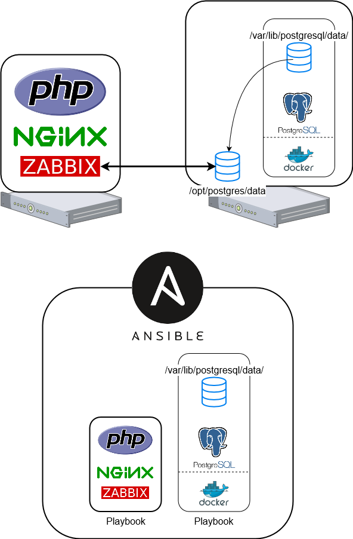

## Zabbix Server Automation

### 概要
Zabbix Server と PostgreSQL の Ansible Playbook  
Zabbix Server の障害時に、インスタンスを破棄し、Playbook を使って再構築する。  
PosrgreSQL も同様に、障害を検知したらインスタンスを破棄し、Playbook を使って再構築する。

### 構成

